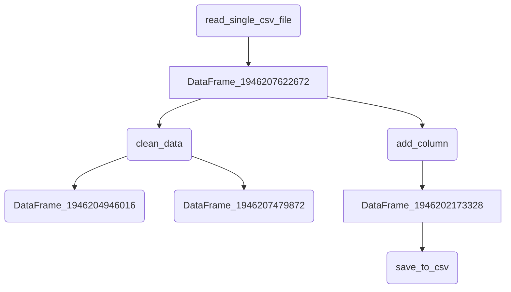

# ETL Decorators

```mermaid
graph TD

    read_single_csv_file(read_single_csv_file) --> DataFrame_1946207622672(DataFrame_1946207622672)
DataFrame_1946207622672[DataFrame_1946207622672] --> clean_data(clean_data)
clean_data(clean_data) --> DataFrame_1946204946016(DataFrame_1946204946016)
clean_data(clean_data) --> DataFrame_1946207479872(DataFrame_1946207479872)
DataFrame_1946207622672[DataFrame_1946207622672] --> add_column(add_column)
add_column(add_column) --> DataFrame_1946202173328(DataFrame_1946202173328)
DataFrame_1946202173328[DataFrame_1946202173328] --> save_to_csv(save_to_csv)
```